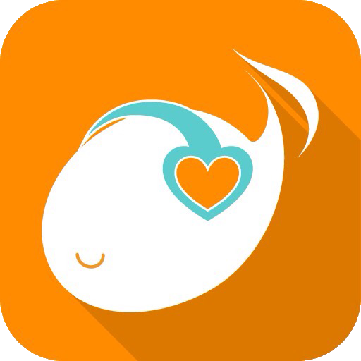

# MusicFav



MusicFav is a Music RSS Reader that focuses on listeing music comfortably.
Currently this app is not available on App Store,
but is available via TestFlight Beta Testing.


## How to build

- Use xcode 7.0
- Install [CocoaPods][] via `bundle install`
- Install [Carthage][] (0.7.5)
- Install dependencies with below:

  ```shell
  scripts/make.swift install
  ```
- Download [Google analytics iOS SDK][] as submobule

  ```shell
  git submodule init
  git submodule update
  ```
- Edit config files for third party api
    - config/feedly.json
      - You can get sandbox api key at [Feedly Cloud API][]
    - config/soundcloud.json
      - Put your [SoundCloud API][] app Client ID
    - config/fabric.json (not necessary)
      - Put your [Fabric][] api key and build secret
- Open and build MusicFav.xcworkspace with xcode

[Carthage]:                 https://github.com/Carthage/Carthage
[CocoaPods]:                https://cocoapods.org/
[Feedly Cloud API]:         https://developer.feedly.com/
[SoundCloud API]:           https://developers.soundcloud.com/
[Fabric]:                   https://get.fabric.io/
[TestFlight Beta Testing]:  http://musicfav.github.io//flight/
[Google analytics iOS SDK]: https://developers.google.com/analytics/devguides/collection/ios/resources
